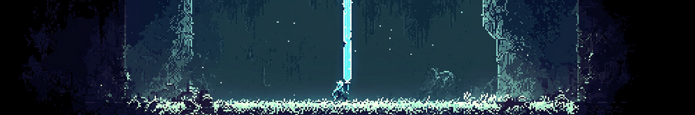

# Chain's End

A lore driven 2d pixel art side scroller built on the Ethereum blockchain. 

In a world of never ending connected blocks, a wanderer sought revenge for his lost love. She was cut away by an enemy wielding a sword that could slice through the very chains that stabilized their world, casting her to the endless void. 
The wanderer traveled through the Chain Verse fighting countless battles, each bringing him closer to the one who took everything from him. Many stood in his way, but his grief was stronger than any obstacle.
When he finally faced the enemy, the battle was more than just a clash of weapons—it was a confrontation with loss itself.
In the end, he did the only thing that could truly heal: he cast the sword into the void, hoping to prevent such pain from ever happening again.
And so he wanders on, his journey forever blazed in the blockchain.

## Tech, Libs, & Frameworks

Web: React, TypeScript

Smart contracts: Solidity, Ethers.js, Hardhat

Game engine: Phaser

### Backend:

Follow the README.md in ``/backend``

### Frontend:

Follow the README.md in ``/frontend``

Submitted to QuackHacks 2025